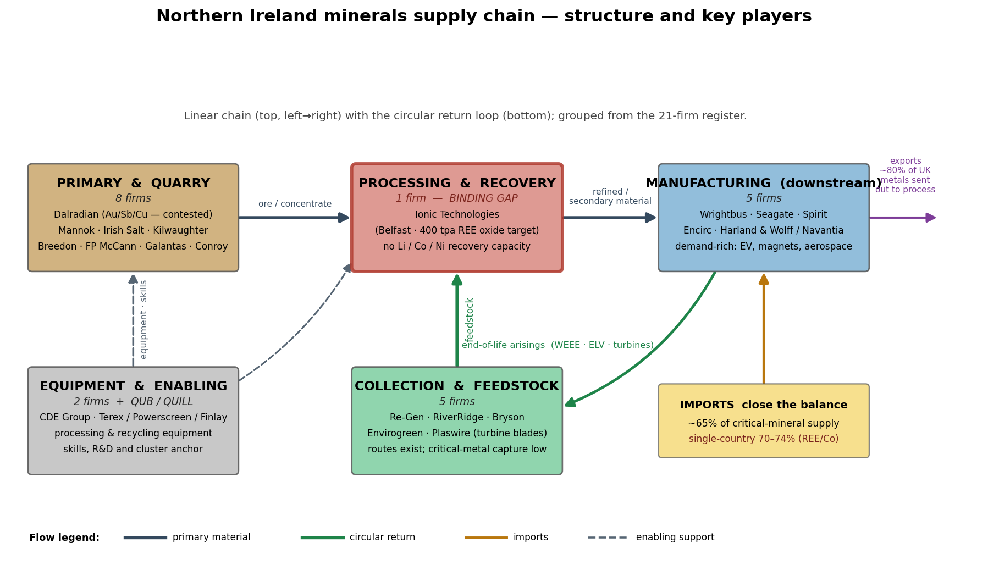
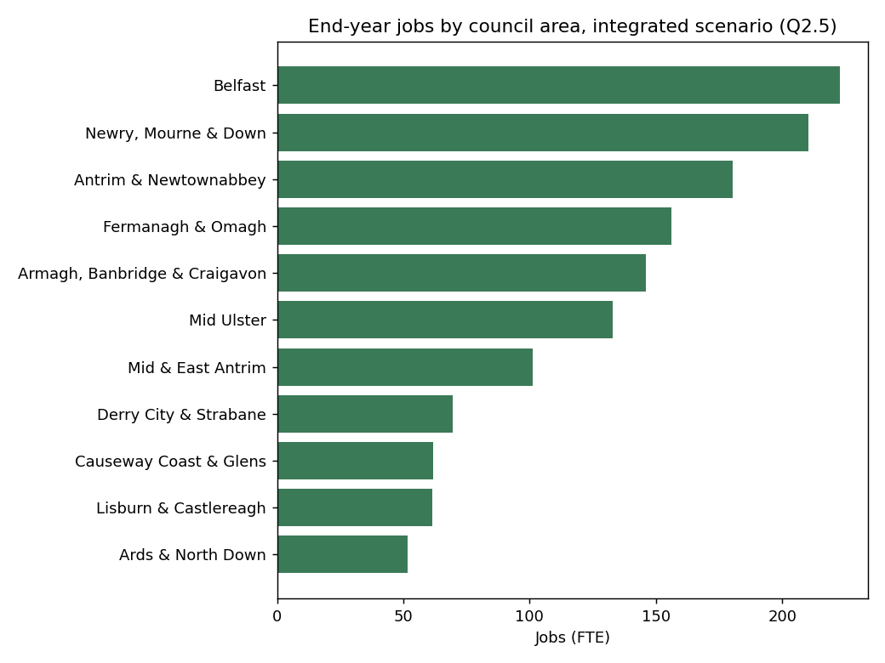
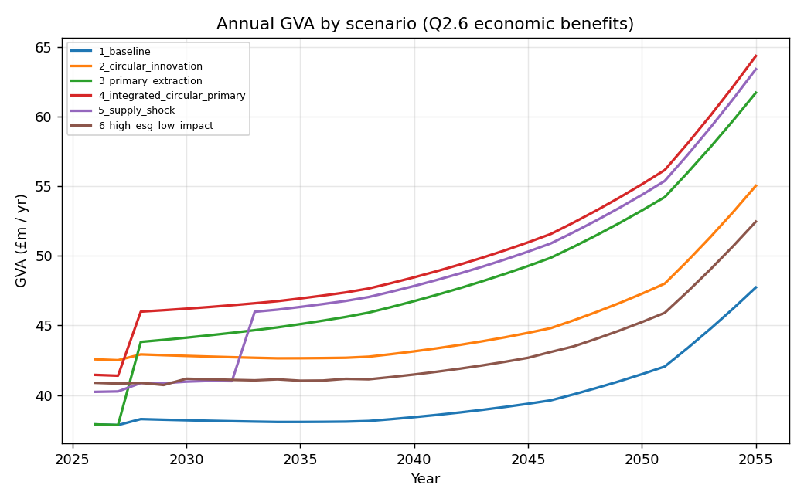

# Northern Ireland Circular Minerals — Integrated Model Report

**Prepared for:** Department for the Economy (DfE) minerals & circular-economy consultation
**Subject:** an integrated Agent-Based × dynamic Input–Output × Computable General Equilibrium (CGE) model of the Northern Ireland minerals system, and its answers to consultation questions 2.1–2.7.
**Status:** Tier-3 (fully coupled), validated against the Minviro evidence and the NI baseline, CI-checked (61-check harness).

> **How to read this report.** This is a *policy-scenario simulator*, not a forecasting tool. Real, sourced anchors are used for validation and control totals; most economic-structure coefficients and behavioural parameters are **proxy** values, flagged in `model/data/data_register.csv`. Every figure below is model behaviour under stated assumptions — **not a prediction**. Swapping the proxies for collected NI data (same model interfaces) turns this into a calibrated decision tool.

This report has three parts, matching the request:

1. **How the model is built** — methodology, technical detail, the supply-chain structure & key players, and validation results.
2. **Data & assumptions** — what data built the model and what was assumed about it.
3. **Answers to the seven questions** — for each, the experiment logic, the data used, the results (tables/figures), and how the results produce the answer.

> **This revision incorporates new external evidence** (data register + model code): the **Vision 2035 annex 2035 cumulative-demand tonnages** as the demand anchor; an **IEA-2025 top-three & refining/processing concentration risk metric** (and export-control flag) beside single-country exposure (Q2.4); the **"critical & growth minerals"** distinction (copper is a UK *growth* mineral); the **NISRA ASHE 2025** wage anchor (£37,100, 2024 retained as a sensitivity); the **NISRA NIETS 2024** trade frame for Q2.6 exports/avoided imports; and the **EU-CRMA stretch targets** (25% recycling, ≤65% single-country) as an EU-market sensitivity. **Q2.7 has been refocused** to the consultation question as posed — the *economic* negative impacts of mineral development (leakage, closure/legacy liability, agriculture/tourism displacement, boom-bust exposure, stranded capital; `econ_impact_module.py`), with environmental impacts moved out of scope (still tracked in the I-O CO₂/PM satellites). The harness is now **61 checks**.

---

# Part 1 — How the model is developed

## 1.1 Purpose and approach

The model simulates the NI minerals system end to end and asks not "mining *vs* recycling" but **which mix** of primary extraction, recycling, substitution, circular design, imports and public support delivers the best balance of supply resilience, GVA, employment, environmental protection and community acceptance:

```
primary extraction → processing/refining → manufacturing use → in-use stock
   → end-of-life arisings → collection → recovery/recycling → secondary material
   → (imports/exports close the balance)
```

- **Horizon:** 30 years (2026–2055), discounted at the HM Treasury / NIGEAE **Social Time Preference Rate of 3.5%**.
- **Coupling style:** *soft-linking* — the engines run sequentially on an annual step, passing objects between them. This is the debuggable, independently-validatable choice (vs simultaneous solving).
- **Grounding:** the agents are **named NI firms** (21 of them) and every policy lever maps to a **named real-world instrument** (NWF/UKEF, BICS, EU CRMA strategic-project route, etc.).

## 1.2 The NI minerals supply chain and its key players

The model is populated from a register of 21 named NI operators (`company_register.csv`), grouped into the five supply-chain stages below. The single most important structural fact — which drives most of the findings — is the **midstream bottleneck**: NI has strong upstream extraction and very strong downstream manufacturing demand, but only **one** critical-mineral processing/recovery asset (Ionic Technologies, 70 staff).



| Stage | Firms | Jobs | Key named players | Role in model |
|---|---|---|---|---|
| **Primary / mining** | 8 | 2,840 | Dalradian (Au/Sb/Cu, contested), Mannok, Irish Salt, Kilwaughter, Breedon/Whitemountain, FP McCann, Galantas, Conroy | deposit-quality & social-licence signal |
| **Collection / feedstock** | 5 | 824 | Re-Gen, RiverRidge, Bryson, Envirogreen, Plaswire (turbine blades) | feedstock-collection signal |
| **Processing / recovery** | **1** | **70** | **Ionic Technologies** (Belfast, 400 tpa REE-oxide target) | recovery-capacity signal — **the binding gap** |
| **Downstream demand** | 5 | 8,470 | Wrightbus, Seagate, Spirit, Encirc, Harland & Wolff/Navantia | demand + recycled-content uptake |
| **Equipment / enabling** | 2 | 1,500 | CDE Group, Terex/Powerscreen/Finlay (+ QUB/QUILL) | equipment, skills, cluster anchor |

NI's distinctive assets: a real **rare-earth recycling cluster** (Ionic + QUB's QUILL + Plaswire), **Belfast Harbour** as an offshore-wind decommissioning hub (a magnet-feedstock pipeline), a **£1,164m named-firm investment pipeline**, and **dual UK + EU market access** via the Windsor Framework.

## 1.3 Architecture — the coupled engines

Three soft-linked engines run on a physical backbone, with spatial and indicator layers on top:

```
 SCENARIO / POLICY LEVER LAYER  (grants, permitting, ESG, finance, offtake,
   collection, procurement, design standards, skills, stockpile, shocks)
        │ policy parameters
        ▼
 ABM (named NI firms)  → signals: new_domestic, recovery_boost,
   MiningFirm · RecyclerFirm · ManufacturerFirm · GovernmentCollector
        │ physical signals          ▲ behaviour ← prices/wages (CGE feedback)
        ▼                           │
 MFA (stock-flow per mineral; mass balance; supply shares; shocks)
        │ final demand (£m)
        ▼
 Dynamic Leontief I-O (GVA, jobs, CO₂, PM; Type I/II; coefficients evolve)
        │                           ▲ feedback (price, wage)
        ▼                           │
 CGE on NI SAM (Cobb-Douglas VA + Armington CES; prices, wages, GVA)
        │
        ▼
 Spatial layer (jobs → 11 councils)   +   Indicators (Q2.1–2.7 + validation)
```

## 1.4 Module-by-module technical detail

**Material Flow Account (MFA) — the physical backbone.** For each of 10 minerals and each year it tracks a stock-flow account from seed parameters `(demand, lifetime, collection, recovery, domestic share, import concentration)`:

- End-of-life arisings = inflow placed on market `lifetime` years ago (ring buffer).
- `collected = eol · min(0.95, coll + collection_boost)`; `recycled = collected · min(0.98, rec + recovery_boost)`; secondary supply `= min(recycled, demand)`.
- Domestic primary `= demand · min(1, dom0 + new_domestic)`; **imports close the balance**, subject to a shock cap.
- **Mass balance is checked every year, every mineral:** `domestic + imports + secondary + unmet = demand` (±1e-6).
- Supply-security indicators: domestic / recycled / import shares, supply-gap share, and `single_country_exposure = import_share · import_concentration`.
- **Upstream shock** = an optional `import_constraint` (static `{mineral: cap}` *or* a callable `f(t)` for a time-varying onset) modelling a **dominant-supplier loss**. If capped imports + domestic + recycled cannot meet demand, the shortfall is recorded as **`unmet_demand` (the supply gap)** rather than silently imported — this is the threat that hits downstream firms.

**Agent-Based Model (ABM) — firm-grounded (mesa 3.x).** Every agent is a named NI operator parsed from the register.

- **MiningFirm** makes a yearly real-option development decision: it develops only if `margin > dev_hurdle (0.45)` **and** `social_licence > 0.4`, where margin nets deposit quality × price signal, grants and skills against ESG cost, project risk and a finance-eased WACC (11.26%), and social licence rises with a community-benefit package. So the best deposit (Dalradian, high planning-risk) stays blocked unless community benefit lifts its social licence — the central Q2.2 result.
- **RecyclerFirm** (processor like Ionic, or collector like Re-Gen/Bryson) raises a `recovery_boost` from a viability score driven by recycling/innovation grants, recycled-content demand pull, offtake support, energy cost and capacity.
- **ManufacturerFirm** raises recycled-content uptake (which shifts the I-O mining→recycling coefficient); equipment firms (CDE, Terex) provide static capex support.
- A `GovernmentCollector` runs policy-driven municipal collection. **CGE feedback** (Tier-3) raises the development hurdle with the wage index and feeds a mineral price signal back into mining decisions.

**Dynamic Input–Output (I-O).** Leontief production accounting, `L = (I − A)⁻¹`, on an 8-sector proxy table scaled by `DOMESTIC_INTENSITY = 0.62` (the high import leakage of a small open region). Type I (direct+indirect) and **Type II** (adds induced, via a closed household row/column). Satellites per £m output give GVA, jobs, CO₂ and PM. Coefficients **evolve** annually from ABM signals (recycling substitution, local-procurement gain, productivity). Calibrated so a mining demand shock yields ~10 total jobs/£m and a Type-II mining output multiplier ~1.69.

**Social Accounting Matrix (SAM) + CGE.** NI has no published SAM, so one is **constructed and balances by construction** (row=column to ~1e-12), pinned to the real **£108m mining-GVA anchor** within ~£40,000m total NI GVA. The compact recursive-dynamic **CGE** uses Cobb-Douglas value added (calibrated to replicate the benchmark exactly), **Armington CES** (σ=2.0) for domestic-vs-import substitution and constant-elasticity exports (σ=2.0); flexible wages/rentals clear factor markets. It is solved with `scipy.optimize.root`; a partial-equilibrium fallback (`PEPriceLabour`) guarantees a result if the full solve ever fails. Feedback to the ABM: the relative mining price (clipped 0.8–1.5) and the wage index.

**Spatial layer.** Allocates sectoral jobs to the **11 NI Local Government Districts**, blending population-tilted shares 50/50 with the **actual named-firm geography** (so mining concentrates in Fermanagh & Omagh, manufacturing in Belfast and Mid & East Antrim). District shares sum to 1 per sector.

**Coupling loop (annual).** price index → ABM step → strategic-stockpile drawdown → MFA step → I-O coefficient update → final-demand vector + impacts → CGE solve → spatial allocation + discounting. Demand growth optionally **plateaus after 2035** so document-anchored CAGRs do not compound unrealistically over 30 years.

## 1.5 Policy levers

Sixteen levers, each mapped to a named instrument; default 0 so the baseline is undisturbed.

| Lever | Acts on | Named instrument |
|---|---|---|
| `finance_support` | mining cost of capital | NWF + UKEF |
| `exploration_grant` | mining margin | exploration support |
| `permit_years` | mining delay | EA priority-tracked permitting |
| `community_benefit` | social licence | community-benefit / ESG scheme |
| `recycling_grant` | recycler viability | capital recovery grants (Vision 2035 DBT) |
| `innovation_grant` | recovery yield + design | CLIMATES £15m + Faraday/ReLiB £34m |
| `energy_cost_index` | recycler viability | BICS energy support |
| `secondary_market_support` | recycler + manufacturer | UKEF offtake + price floor (cf. MP Materials) |
| `collection_infrastructure` | collection rates | WEEE / Deposit-Return Scheme |
| `product_passport` | collection + design | digital passports / EPR |
| `recycled_content_procurement` | substitution | minimum recycled-content procurement |
| `design_standards` | substitution | ecodesign / design-for-disassembly |
| `local_supplier_support` | I-O local procurement | supplier development (Invest NI) |
| `skills_support` | capacity + mining | Skills England + DWP |
| `strategic_stockpile` | import buffer | defence stockpile (Japan/Korea practice) |
| `diversification` | single-country concentration | international partnerships (cuts effective concentration up to 50%) |

The **supply shock** itself is not a lever but an `import_constraint`, with caps set to `1 − loss_factor × (single-country concentration)`.

## 1.6 Model validation results

**(a) Validation against the Minviro independent evidence.** The I-O core is validated by injecting a mining final-demand shock sized to Minviro's one-mine (£7.3m) and two-mine (£43m) total output, then comparing **jobs** and **direct** mining GVA like-for-like:

| Scenario | Metric | Model | Minviro anchor | Result |
|---|---|---|---|---|
| One mine (3a) | Output (£m/yr) | 7.30 | 7.3 | ✅ exact (calibration target) |
| One mine (3a) | Jobs | 73.1 | 73 | ✅ within 0.1% |
| One mine (3a) | Direct mining GVA (£m) | 1.58 | 1.6 | ✅ within 1.5% |
| Two mines (4b) | Output (£m/yr) | 43.0 | 43 | ✅ exact (calibration target) |
| Two mines (4b) | Jobs | 430.4 | 430 | ✅ within 0.1% |
| Two mines (4b) | Direct mining GVA (£m) | 9.29 | 9.0 | ✅ within 3.2% |

**(b) Verification & continuous integration.** A harness (`verify_model.py`) runs **61 checks** on every change and **gates the CI build** (`.github/workflows/verify.yml`):

- *Invariant checks* — MFA mass balance (baseline + shock), supply-share bounds & closure, no NaN/negatives, **determinism** (identical config → byte-identical output), SAM balance (~1e-12) + the mining-GVA anchor, CGE benchmark replication (wage = 1.000), CGE partial-equilibrium fallback, spatial share closure, stockpile reserve non-negativity & depletion, register integrity, economic-sanity ranges, the geopolitical features (diversification, time-varying shock), and the **IEA-2025 top-three/refining/export-control risk metrics** (top-three exposure ≥ single-country; refining & export-control exposures bounded).
- *Property-based / fuzz checks* — 30 random valid policy bundles (random lever subsets, demand growth, static/time-varying shocks, plateau, CGE on/off) must **all** preserve mass balance, share closure, no-NaN/negatives and a non-negative reserve.

**All 61 checks pass.** The model is deterministic and reproducible (`python run_mvm.py; python verify_model.py`). A durable, layered validation report (design rationale, summary, per-check results and limitations) is generated by `model/validate_model_report.py` → [`word/Model_Validation_Report.docx`](word/Model_Validation_Report.docx) (61 passed / 0 failed).

**(c) Validation of the new evidence layer (this revision).** The IEA-2025 risk indices and the critical/growth split were independently re-validated across a 30-year shocked run: **top-three exposure ≥ single-country exposure in every year** (the top-three cluster always contains the dominant supplier), **refining, export-control and critical-only shares stay within [0,1] every year**, and **determinism holds with the new columns** (identical reruns match). The **critical-only** recycled share (copper excluded) runs *below* the critical-&-growth figure (e.g. ~0.165 vs ~0.225 in the shocked run) — confirming that including copper, a UK *growth* mineral, modestly flatters the headline critical-mineral share, which is exactly why it is reported separately.

---

# Part 2 — Data used and assumptions

## 2.1 The provenance system

Every parameter carries a status in `model/data/data_register.csv` (~105 parameters):
🟢 **real** (sourced/audited) · 🟡 **proxy** (desk/scaled) · 🔴 **gap** (placeholder). The headline pattern is honest: **the validation anchors and supply-concentration figures are real; most economic-structure and behavioural coefficients are proxy.**

## 2.2 Real anchors and control totals (used to validate / pin the model)

| Item | Value | Source |
|---|---|---|
| NI mining & quarrying GVA (2018) | £108m (0.27% of NI GVA) | ONS Regional GVA / NISRA via Minviro |
| NI mining & quarrying workers | 1,950 | NISRA BRES |
| NI total employee jobs (Sep 2023) | 816,562 | NISRA BRES |
| Minviro one-mine scenario | 73 jobs / £7.3m output / £1.6m GVA p.a. | Minviro Final Report |
| Minviro two-mine (4b) scenario | 430 jobs / £43m output / £9m GVA p.a. | Minviro Final Report |
| STPR (discount rate) | 3.5% | Green Book / NIGEAE |
| Mining cost of equity (WACC) | 11.26% | Minviro (CAPM) |
| Vision 2035 targets (2035) | ≥10% domestic / ≥20% recycling / ≤60% single-country | Vision 2035 (GOV.UK) |
| **EU-CRMA targets (2030)** — EU-stretch sensitivity | 10% extraction / 40% processing / **25% recycling** / ≤65% single third country | European Commission CRMA |
| **NI median FT wage (2025)** | **£37,100/yr (£713/wk)** — up from £34,632 (2024) | NISRA ASHE 2025 |
| 2023 single-country supply concentration | REE 74% China, Co 70% DRC, Li 44% Australia | BGS / Idoine et al. 2025 |
| **Top-three producer concentration (2024)** | **~86%** for Cu/Li/Ni/Co/graphite/REE | IEA 2025 |
| **Refining concentration (2024)** | China leads refining for **19 of 20** strategic minerals (~70% avg) | IEA 2025 |
| **Export controls (2024)** | affect **~55%** of energy-related strategic minerals | IEA 2025 |
| **NI external trade (2024)** | sales £109.3bn; exports £19.6bn; imports £11.2bn; surplus £8.4bn | NISRA NIETS 2024 |
| UK metals exported for processing | ~80% | GSNI/BGS OR25042 |
| NI municipal recycling rate (2024/25) | 50.4% (flat since 2019) | DAERA LAC municipal waste |
| Curraghinalt (Dalradian) resource | 3.79 Moz Au M&I (+Cu/Sb/Te/Bi/Co) | Dalradian 2021 feasibility study |

## 2.3 Firm evidence (the ABM agents)

`company_register.csv` holds 21 named NI operators — 13 web-verified, 8 desk-verified — each with role, district, lifecycle stage, employees, investment, capacity, and eight 0–1 scores (resource, capacity, feedstock, demand, local-procurement, planning-risk, skills, circularity) that drive agent behaviour. Derived aggregates: **£1,164m** named-firm capital pipeline; **400 tpa** installed REE-recovery capacity (Ionic). Firm scores are desk estimates and are the main *behavioural* calibration dependency (see §2.6).

## 2.4 Strategy-grounded demand and support data

**Demand has two layers.** The **demand-supply strategy experiment** (`q_demand_supply_strategy.py`) is anchored to the **Vision 2035 Technical Annex (Annex 2) 2035 cumulative-demand tonnages**. The seven core Q2 experiments use the shared `GREEN_DEMAND` policy-growth path (`DEMAND_GROWTH_EV`, `DEMAND_GROWTH_WIND`, plus conservative metal-specific proxy growth rates) unless otherwise stated. The annex's cumulative UK demand at 2024/27/30/35 is differenced to annual increments and converted to a CAGR, cross-checked against IEA net-zero:

| Mineral | 2035 cumulative demand (UK, t) | Annex-derived annual CAGR | IEA cross-check |
|---|---|---|---|
| Aluminium | 8,003,000 | 9.3% | — |
| Copper *(growth mineral)* | 3,619,000 | 4.3% | ~2× by 2040 |
| Nickel | 867,200 | 10.8% | ~2× by 2040 |
| Lithium | 339,200 (LCE) | 26.5% | ~9× by 2040 |
| Cobalt | 163,000 | 9.2% | ~2× by 2040 |
| REE_magnet | 37,940 | 8.8% | ~2× by 2040 |

> **Critical vs growth minerals.** Per the Vision 2035 annex, **copper is a UK *growth* mineral** (fundamental to advanced manufacturing & clean energy), **not** a current UK *critical* mineral. The model keeps copper inside the supply-security aggregates (it is strategically central to NI) but flags it, so the basket is reported as **"critical & growth minerals"** and copper's relatively secure, well-diversified supply does not overstate the *critical*-mineral domestic/recycled share.

**Support-mechanism evidence (used to design and cost the Q2.3/Q2.4 levers):**

| Item | Value | Source |
|---|---|---|
| Strategic-stockpile targets | Japan 60–180 days, Korea 100 days | IEA; CSEP 2025 |
| FOAK cost-share | 20% prototype / 50% pilot | US DOE Critical Minerals Accelerator |
| Blended-finance fund | US$500m | US–Australia Critical Minerals Partnership Fund |
| Offtake + price floor | 10-yr / $110/kg NdPr | US DoD–MP Materials (CSIS 2025) |
| EU CRMA strategic-project permits | 15-mo processing / 27-mo extraction + finance + offtake | European Commission |
| Lever public costs (NI-scale) | CLIMATES £15m, ReLiB £34m, DBT £50m, DEFRA DRS £632m setup / £1.065bn/yr | Innovate UK / DEFRA / DfE |
| Japan post-2010 diversification | China REE dependence ~90%→~58% (JOGMEC $250m Sojitz–Lynas deal) | CNBC; WEF; IEA |

## 2.5 Key calibrated parameters

| Parameter | Value | Status |
|---|---|---|
| `DOMESTIC_INTENSITY` (A-matrix scaling) | 0.62 | proxy (import leakage of a small open region) |
| `GVA_COEFF` (mining) | 0.35 | proxy, tuned to Minviro direct-GVA anchors |
| `EMP_COEFF` (mining) | 11.5 jobs/£m | proxy, anchored to 1,950 jobs |
| Recovery yields REE / Li / Cu | 0.85 / 0.50 / 0.90 | desk-verified (Met4Tech, ReLiB, Ionic) |
| WEEE collection baseline | 0.25 | desk-verified (UN Global E-waste Monitor) |
| Concentration REE / Co / Li | 0.74 / 0.70 / 0.44 | **real** (BGS/Idoine 2025) |
| Dev hurdle / social-licence floor | 0.45 / 0.40 | **proxy** behavioural thresholds |
| CES elasticities σ(Armington)/σ(export) | 2.0 / 2.0 | proxy |
| Stockpile depth / release rate | 0.5 demand-yr (~180 d) / 0.30 | calibrated to JOGMEC/KOMIR |

## 2.6 Assumptions made about the data, and limitations

The biggest assumptions are deliberately surfaced (full list in `TECHNICAL_DOCUMENTATION.md` §8):

1. **The I-O coefficient matrix is proxy**, not a regionalised NI table — scaled for high import leakage and tuned to the Minviro anchors. *This is the single biggest calibration dependency.* (Replace with NISRA Supply-Use + Scottish 2017 I-O via FLQ + RAS.)
2. **The SAM structure is proxy** (only mining GVA is a real anchor); the CGE is a compact reduced form with proxy elasticities.
3. **MFA stock-flow seeds are UK data scaled to NI** — NI-level critical-mineral waste flows are a known gap. Commodity prices are indicative.
4. **Behavioural thresholds** (dev hurdle, social-licence floor, risk→delay, lever→effect coefficients) are **proxy** and determine which marginal projects open — the first thing to calibrate with planning/licensing records and a firm survey.
5. **Demand CAGRs are UK-national, scaled uniformly to NI's base**; the annex is read as *cumulative* demand (well-supported but not stated outright in the PDF).
6. **Public costs / ROI** are NI-scale figures benchmarked to UK programmes by population, used only for *relative* ranking — not budget lines (a ±cost band is carried for sensitivity).
7. **Environmental satellites** (CO₂, PM) are proxy and remain tracked in the I-O outputs. Q2.7 is now an **economic-negative-impact** layer; its leakage, closure, displacement, volatility and stranded-capital parameters are proxy/desk values. The model does **not** do site-specific EIA.

> The honest bottom line: the model's **structure, internal consistency and direction of travel are robust and validated**; the **absolute magnitudes are illustrative** until the proxy economic/behavioural layer is replaced with collected NI data.

---

# Part 3 — Answers to the seven consultation questions

Each question below gives: **(i)** the experiment logic, **(ii)** the data used, **(iii)** the results (table/figure), and **(iv)** how the results produce the answer. All scripts write CSVs + a findings memo to `model/outputs/` and appear as tabs in the Streamlit dashboard.

## Q2.1 — How can the Department support innovation for circularity?

**(i) Experiment logic.** Seven candidate interventions (materials-recovery capital, a circular-innovation R&D fund, smart collection/DRS, secondary-market offtake, ecodesign standards, a green-skills cluster, and the full package) are mapped onto the firm-grounded ABM and run individually and combined over 30 years. Each is ranked on recycled-share lift, recycling GVA/jobs, circular-design uptake, and **GVA-ROI with a cost-uncertainty band**.

**(ii) Data used.** Recovery yields (Met4Tech/ReLiB/Ionic), WEEE collection baseline 0.25 (UN E-waste Monitor), the UK Deposit-Return-Scheme uplift (container return 70–75%→>90%) to calibrate the collection lever, and NI-scale lever costs benchmarked to CLIMATES (£15m), ReLiB (£34m), DBT (£50m) and the DEFRA DRS impact assessment.

**(iii) Results.**

| Intervention | Δ recycled share (pp) | Δ cum. GVA (£m) | Recycling jobs (end) | GVA-ROI (low–central–high) |
|---|---|---|---|---|
| Materials-recovery capital | 0.0 | 0.5 | 553 | 0.0–0.01–0.01 |
| Circular-innovation fund | 0.0 | 0.5 | 554 | 0.0–0.01–0.01 |
| **Smart collection / DRS** | **+6.3** | **+244.9** | **814** | 0.57–**1.26**–2.30 |
| Secondary-market offtake | 0.0 | 0.6 | 554 | 0.0–0.01–0.02 |
| **Ecodesign standards** | +2.3 | +92.5 | 653 | 1.10–**2.21**–4.43 |
| Green-skills cluster | 0.0 | 0.0 | 553 | 0.0 |
| **Integrated package** | **+6.3** | **+246.1** | 818 | 0.28–0.56–1.04 |

**(iv) How this leads to the answer.** Two robust results emerge: **in the near-term Q2.1 intervention test, collection/feedstock is the binding constraint** — smart collection/DRS is the *only* single lever that reaches the Vision-2035 20% recycling target (subsidising recovery *plant* alone moves little because NI's immediate gap is feedstock); and **ecodesign standards are the best value for money** (~2.2× GVA per £, robust across the whole cost band, because they are mostly regulatory). This does **not** mean processing capacity is unimportant: the cross-cutting capacity audit shows no NI lithium, cobalt, nickel, copper or aluminium processing capacity, so processing becomes a binding midstream gap as demand scales. The **mix beats any single lever**. **Sequencing:** *now* — recycled-content procurement + design standards + product passports (cheap, high return); *then* — a Circular Innovation Fund and collection/DRS to unblock feedstock; *then scale* — processing/recovery capacity for battery metals and growth minerals. **Against the stricter EU-CRMA 25% (2030) recycling stretch** — relevant if NI serves the EU market under the Windsor Framework — no single lever qualifies, reinforcing that the EU benchmark requires the full circular build-out.

## Q2.2 — Key opportunities and challenges for sustainable development

**(i) Experiment logic.** A mineral-by-mineral opportunity score (demand pull, domestic geology, circular potential, strategic value, economic value) from the register + MFA; then **constraint-relaxation scenarios** that relax one barrier at a time (permitting, finance, community/social-licence, skills, energy) to find the *binding* constraint.

**(ii) Data used.** Firm register scores, GSNI/BGS geology (Curraghinalt 3.79 Moz Au + Sb/Te/Co; Mourne REE potential), import-dependence from the MFA, and BGS/Idoine concentration.

**(iii) Results — what unlocks development:**

| Constraint relaxed | Mines opened | Δ cum. GVA (£m) | Project unlocked |
|---|---|---|---|
| Faster permitting | 0 | 0.0 | — |
| Finance (NWF/UKEF) | 1 | +1.7 | Baryte (geological-potential) |
| Skills availability | 0 | 0.0 | — |
| Energy competitiveness | 0 | 0.0 | — |
| **Community benefit / social licence** | **1** | **+208.1** | **Dalradian** |
| All enablers together | 2 | +226 | Dalradian + Baryte |

Top opportunity-ranked minerals: REE_magnet (0.62, recycling), **Copper (0.60, *growth* mineral, primary+recycling)**, Lithium (0.55), Cobalt (0.49), Aluminium (0.45) — the opportunities are overwhelmingly **circular**. Per the Vision 2035 annex, copper is a UK **growth** mineral (not on the critical list), so this basket is read as **"critical & growth minerals"**; copper's strong rank reflects industrial-resilience value rather than critical-supply scarcity.

**(iv) How this leads to the answer.** The **binding challenge is social licence, not economics**: NI's best deposit clears the commercial hurdle but is blocked by community opposition, and a credible **community-benefit package is the only lever that brings it forward** — worth roughly *ten times* finance, permitting or skills support alone (+£208m GVA, ~+600 jobs). Opportunities are led by the **circular pathway** (NI has little domestic critical-mineral geology), so critical-mineral security is mainly a recycling story. Bulk minerals (baryte, salt, aggregates) are the low-friction near-term opportunity.

## Q2.3 — What support do businesses need to participate?

**(i) Experiment logic.** Vision 2035 warns supply chains are "vulnerable to shocks such as … war or geopolitical fallout". We model a **dominant-supplier loss** (per-mineral import caps = 1 − single-country share) + a price spike, map firms to supply-chain stages, and read outcomes by stage; then sweep **shock severity** (½× → 1.5× of the dominant supplier lost) and test a **finite, depleting strategic stockpile**.

**(ii) Data used.** 2023 concentration (REE 74%/Co 70%/Li 44%, BGS/Idoine); named support instruments (NWF/UKEF, BICS, FOAK cost-share, offtake+price-floor, DRS); stockpile sized to JOGMEC/KOMIR (60–180/100 days).

**(iii) Results — support package under the shock:**

| Scenario | Early-5yr gap | End gap | Recycled share | Total jobs (end) | Δ jobs vs unsupported |
|---|---|---|---|---|---|
| No shock, no support | 0.00 | 0.00 | 0.147 | 1,148 | +78 |
| Shock, no support | 0.051 | 0.204 | 0.135 | 1,069 | 0 |
| + Upstream support | 0.051 | 0.155 | 0.135 | 1,687 | +618 |
| + Midstream support | 0.016 | 0.136 | **0.204** | 1,421 | +351 |
| + Downstream support | 0.051 | 0.204 | 0.135 | 1,069 | −0.4 |
| + Enabling (stockpile) | 0.038 | 0.204 | 0.135 | 1,069 | −0.2 |
| **+ Full cross-chain** | **0.013** | **0.112** | 0.204 | **2,039** | **+969** |

The shock is acutely **mineral-specific**: per-mineral unmet gap = REE 73%, Antimony 70%, Cobalt 69%, Lithium 43%, Nickel 27%, Aluminium 19%, Copper 12%.

**(iv) How this leads to the answer.** Support must be **sequenced and stage-specific**. *Downstream support alone barely moves the dial* — manufacturers cannot buy recycled content that does not yet exist — so it must follow midstream investment. The participation barrier is the **pilot-to-commercial "valley of death"** (exactly Ionic's position); the evidence-based unlocks are **FOAK capital with cost-share + blended finance** and **long-term offtake with a price floor** (cf. DoD–MP Materials). The **stockpile is a thin bridge, not a fix** — it only trims the early gap, then depletes. A single **"strategic project" front door** (EU CRMA via Windsor + UK NWF/UKEF/BICS) lowers the cost of participating.

## Q2.4 — What role should government have in securing supply?

**(i) Experiment logic.** Five government **postures** (light-touch, diversify-&-insure, domestic-autonomy, circular-leader, strategic-coordinator) are tested against an escalating dominant-supplier **export ban** *and* a **Monte-Carlo of 120 uncertain shocks** (random onset, minerals ∝ concentration, severity). Metrics: the Vision-2035 targets, an HHI-style supply-risk index, and the unmet-demand gap distribution.

**(ii) Data used.** Concentration (BGS/Idoine); Vision 2035 / EU CRMA targets; real-world effectiveness evidence — **Japan's post-2010 diversification** (China REE dependence ~90%→~58% via stockpiling + JOGMEC equity/offtake + recycling) as a validated natural experiment.

**(iii) Results — resilience under uncertainty (Monte-Carlo):**

| Role | Mean gap | p90 gap | Worst gap | Single-country exposure | Public cost (£m) |
|---|---|---|---|---|---|
| Market / light-touch | 0.059 | 0.144 | 0.262 | 0.623 | 0 |
| Diversify & insure | 0.056 | 0.135 | 0.252 | 0.400 | 122 |
| Domestic autonomy | 0.048 | 0.120 | 0.208 | 0.602 | 121 |
| Circular leader | 0.040 | 0.098 | 0.185 | 0.607 | 354 |
| **Strategic coordinator** | **0.034** | **0.079** | **0.159** | 0.427 | 516 |


**Beyond single-country: the IEA-2025 midstream-risk view.** The IEA finds the binding risk is now **top-three** mine concentration (rose to ~86% in 2024) and **refining** concentration (China refines 19 of 20 strategic minerals). The model adds both indices; under the export-ban shock (lower = safer):

| Role | Single-country | Top-3 (mine) | Refining (midstream) |
|---|---|---|---|
| Market / light-touch | 0.246 | 0.504 | 0.355 |
| Diversify & insure | 0.158 | 0.423 | 0.355 |
| Strategic coordinator | 0.180 | 0.444 | **0.337** |

The contrast is the key insight: **import diversification cuts single-country and partly top-three exposure, but barely touches refining exposure** — which only falls when NI builds its own recovery/processing capacity (the coordinator and circular roles). The security problem is *midstream*, so the answer must include capacity, not just diversification. (Export-controlled minerals — REE, antimony, cobalt — are flagged but tiny by tonnage, so a tonnage view understates their strategic weight.)

**(iv) How this leads to the answer.** **Light-touch fails the security test** (highest tail risk; security is a public good the market under-provides — confirmed by the IEA observation that critical minerals are *concentrating*, not diversifying). **No single instrument is enough**, and single-country exposure alone *understates* the risk (top-three and refining are far higher). A balanced **strategic-coordinator** posture is the most robust — it roughly **halves the 90th-percentile gap vs light-touch**, improves all three Vision-2035 indicators while adding GVA, and is the only one (with circular-leader) that lowers *refining* exposure. It should be read as **closest/most robust**, not fully target-compliant in every state: domestic share remains below 10%, stable single-country exposure sits just above the 60% threshold after rounding, and some recycled-share results sit just under 20%. The role is an active **coordinator/insurer** (set targets; de-risk midstream; fix collection; diversify + hold a thin reserve; uphold high-ESG terms) — exactly the posture Japan used successfully. Against the stricter **EU-CRMA stretch** (25% recycling, ≤65% single-country) NI needs the circular build-out to compete for the EU market under the Windsor Framework.

## Q2.5 — Local employment, skills and regional growth

**(i) Experiment logic.** The firm-grounded jobs-by-council output is split by skill level and wage band (ONS SOC/ASHE structure on the real NISRA median wage **£37,100, ASHE 2025**), with **retained local employment** (the Minviro leakage fix, rising with local-content + skills) and a skilled-training need, across four scenarios.

**(ii) Data used.** **NISRA ASHE 2025** wage anchor (£37,100/yr, £713/wk — up ~7% from £34,632 in 2024, which is retained as a sensitivity; the premium is a ratio so it is unchanged, the wage bill scales ~7%); ONS ASHE-by-industry; NI skills backdrop (~7,500 skill-shortage vacancies, 5,000+ new roles/yr); Minviro retained-jobs estimates (Scen-2: 52 … two-mine 4b: 7,177); UK Industrial Strategy (Belfast named a critical-minerals cluster).

**(iii) Results.**

| Scenario | Total jobs (end) | High-skill jobs | Wage premium vs NI | Local retention | Skilled-training need |
|---|---|---|---|---|---|
| Baseline | 1,148 | 206 | 1.11× | 70% | 193 |
| Circular innovation | 1,513 | 262 | 1.09× | 80% | 283 |
| Integrated | 2,010 | 390 | 1.17× | 86% | 698 |
| **Local-content + skills** | 1,393 | 244 | 1.09× | **97%** | 254 |



**(iv) How this leads to the answer.** The sector offers **quality jobs above the NI average** (~9–17% wage premium), **rural-weighted** regional growth (Belfast + the west/Mid Ulster), and — crucially — **local retention is a policy choice**: it rises from ~70% to ~97% under a local-content + skills focus, directly countering the Galmoy/Lisheen leakage Minviro warns of. **Skills are the binding enabler**, so a green-skills/critical-minerals pipeline and apprenticeships are prerequisites, not add-ons.

## Q2.6 — Economic benefits

**(i) Experiment logic.** The coupled Type-II GVA/output/jobs (discounted, 30 yr) are extended with Minviro's full benefit taxonomy — a tax proxy (~25% of GVA), exports, the named-firm investment pipeline, productivity, manufacturing resilience and **avoided import costs** (the import bill met by domestic + recycled supply). Value-for-money is reported on incremental GVA alone *and* with resilience.

**(ii) Data used.** Minviro multiplier basis (NI 2016 + Scotland 2016 I-O), scenario anchors and WACC; named-firm investment pipeline (£1,164m); Minviro retained-jobs/leakage analysis and CLCA carbon (~0.36% of NI CO₂); and the **NISRA NIETS 2024** external-trade frame (NI sales £109.3bn, exports £19.6bn, imports £11.2bn, surplus £8.4bn) to contextualise the export and avoided-import magnitudes.

**(iii) Results.**

| Scenario | Cum. disc. GVA (£m) | Avoided imports (£m) | Tax proxy (£m) | Exports (£m) | GVA BCR | Resilience BCR |
|---|---|---|---|---|---|---|
| Baseline | 788 | 1,215 | 197 | 631 | — | — |
| Circular innovation | 1,019 | 1,567 | 255 | 842 | 0.79 | 2.00 |
| Primary extraction | 790 | 1,218 | 198 | 632 | 0.02 | 0.04 |
| **Integrated** | **1,153** | **1,789** | 288 | 874 | 0.86 | **2.21** |



**(iv) How this leads to the answer.** The benefits are **substantial and broad** — the integrated scenario delivers ~£1.15bn discounted GVA, ~£1.8bn avoided imports, ~£0.3bn tax and ~£0.9bn exports over 30 years, on top of the £1.16bn investment pipeline. The **value-for-money is honest**: on incremental GVA alone the capital-heavy scenarios return below £1, but once **avoided imports / resilience** are counted the return rises to ~2×. **Pure extraction support is the weakest** (little opens without social licence). Headline benefits are an upper bound — the *retained* share depends on the Q2.5 local-content + skills measures. **In the NISRA NIETS 2024 trade frame**, the integrated minerals system contributes only ~0.3% of NI's £19.6bn external exports and displaces ~1.3% of its £11.2bn external imports by year 30 — small by *volume* but high in *strategic value*, protecting a far larger downstream manufacturing base from import-price and supply shocks. (NIETS sector tables are the recommended next calibration step for the proxy export shares.)

## Q2.7 — Potential **economic** negative impacts of mineral development

**(i) Experiment logic.** This answers the consultation question as literally posed — the **economic** downsides of (mainly primary) mineral development, **not** the environmental pressures (carbon/air/land/water/biodiversity stay in the I-O CO₂/PM satellites and are out of scope here). Five Minviro-grounded economic negatives are quantified across scenarios (baseline / circular / lightly-managed primary / integrated / responsible-managed primary): **benefit leakage** (enclave economy), **closure cliff + remediation liability**, **agriculture/tourism displacement**, **boom-bust price-volatility exposure**, and **stranded/sunk capital** on contested long-lead projects (`econ_impact_module.py`).

**(ii) Data used.** Minviro Final Report: retained employment §2.2.5 + Galmoy/Lisheen leakage; mine-closure §1.4.6.8 (Fig 1.33 closure-cost estimates); agriculture §3.4.2.4 & tourism §3.4.2.5 displacement; price-volatility/"volatile inflows". Dalradian Curraghinalt (~£250m proposed, ~21-yr inquiry) for the stranded-capital exposure. Parameters (life-of-mine 18 yr, closure £35m/mine, agri+tourism £3m/mine-yr, volatility 0.30, base retention 0.70) are PROXY in the data register.

**(iii) Results (£m, discounted over 30 years):**

| Scenario | Leakage | Closure liability | Agri/tourism displ. | **Econ-neg total** | per £GVA | Boom-bust /yr | Stranded capital | **Net local GVA** |
|---|---|---|---|---|---|---|---|---|
| Baseline | 136 | 0 | 0 | 136 | 17% | 2.2 | 0 | 653 |
| Circular innovation | 162 | 0 | 0 | 162 | 17% | 2.2 | 0 | 780 |
| **Primary (lightly managed)** | 171 | 72 | 116 | **359** | **36%** | 6.3 | **125** | **639** |
| Integrated circular + primary | 119 | 37 | 70 | 225 | 20% | 6.3 | 73 | 928 |
| **Responsible, managed primary** | 52 | 21 | 54 | **128** | **11%** | 6.3 | 70 | **1,016** |


**(iv) How this leads to the answer.** The economic negatives are real and **largest for primary extraction**: lightly managed, it runs ~£359m of deterministic economic losses (**36% of its GVA**) — leakage + a closure cliff & remediation liability + agri/tourism displacement — **plus** ~£125m of contested capital at risk and a closure cliff (the mine's GVA/jobs vanish at end-of-life). Strikingly, its **net local GVA (£639m) falls *below* the baseline (£653m)** once the negatives are netted off — lightly-managed extraction can leave NI worse off. **Circular activity avoids almost all of it** (no mine → no closure/displacement/stranded risk; only residual leakage). **Responsible, managed development mitigates the rest** — local content + skills cut leakage (retention 70%→92%), **bonded closure** removes the public remediation liability, rehabilitation shortens displacement, and a circular hedge lowers stranded-capital exposure — lifting net local GVA to ~£1,016m. So the answer: the principal economic negatives are **benefit leakage, closure/legacy liabilities, agriculture/tourism displacement, boom-bust exposure and stranded capital**, and they are minimised by **doing development circularly where possible and, where primary proceeds, requiring local content, bonded closure, rehabilitation and a circular hedge**. (Environmental impacts are a separate question — tracked in the I-O CO₂/PM satellites.)

## Cross-cutting: demand outlook & the capacity gap

Running the strategy-derived demand (Vision 2035 / EU CRMA / UK Industrial Strategy, plateauing at 2035) under a supportive, sustainable stance, the NI opportunity grows to **~2,000 jobs and ~£1.25bn discounted GVA** (combined-high-demand case) — but **rising demand erodes the supply-security ratios unless capacity scales with it** (recycled share falls 45%→43%, import share rises 47%→51%). The capacity audit is stark: NI has recovery capacity for **REE only** (Ionic, 400 tpa) and **none for lithium, cobalt or nickel** — the fastest-growing battery metals. The chain is **demand-rich but capacity-poor**; the midstream is the priority gap to fund. Demand sensitivity (±50%) moves end-year jobs across 1,539–2,398 but leaves the **qualitative findings robust**.

---

# Part 4 — Synthesis and reproducibility

**Six recommendations** (detailed in `EXECUTIVE_SUMMARY.md`): (1) build the midstream (FOAK + blended finance + offtake); (2) fix feedstock collection (DRS/WEEE); (3) lead with cheap demand-side rules (procurement, ecodesign, passports); (4) make any extraction responsible and contained (community benefit + high-ESG + bonded closure); (5) tie support to local content & skills (70%→97% retention); (6) create one "strategic project" front door + a thin ~180-day reserve.

**Reproducibility.**
```
cd model
pip install -r requirements.txt
python run_mvm.py                 # main scenario pipeline → outputs/
python verify_model.py            # 61 invariant + property-based checks
python q2_1_circularity_interventions.py … q2_7_negative_impacts.py
python q_demand_supply_strategy.py
python make_supply_chain_fig.py && python make_plots.py   # figures
python export_word.py             # this report + memos → ../word/
streamlit run ../streamlit_app.py # interactive dashboard
```

*All figures are model behaviour under stated assumptions, not forecasts. Parameter-level provenance and status are in `model/data/data_register.csv`; full method and equations in `TECHNICAL_DOCUMENTATION.md`.*
